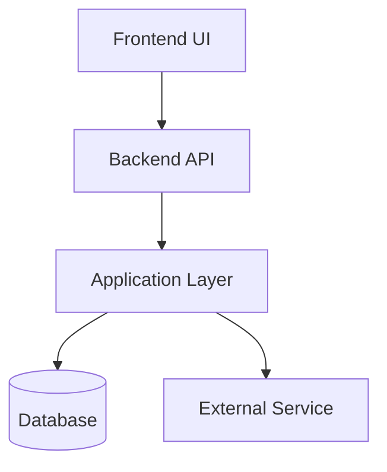
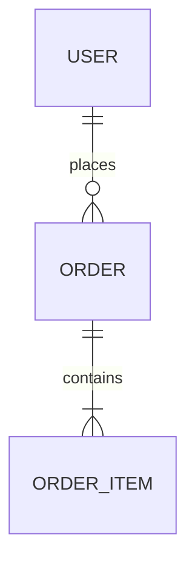

# ARD: <architecture-title> - version 1.1 - last updated: 2026-04-12 - by Laurie and Patrick

- Status: Draft / Proposed / Approved / Superseded
- Date: YYYY-MM-DD
- Owners:
- Related BRD:
- Related PRD:
- Related ADR(s):
- Related Feature(s):

---

## Executive Summary

Provide a concise summary of the architecture.

Answer:
- what this architecture covers
- why it exists
- who it serves
- what key problem it solves
- what the chosen architectural direction is

Keep this section readable by both technical and non-technical stakeholders.

---

## Context

Describe the project or feature context that led to this architecture work.

Include:
- business or product background
- technical background
- current pain points or constraints
- expected scale or usage context
- delivery context
- assumptions that materially affect architecture

---

## Goals

List the architectural goals.

Examples:
- support maintainable feature delivery
- improve scalability
- reduce coupling
- improve reliability
- enable testability
- enforce clear boundaries
- strengthen security posture
- simplify operational support

---

## Non-Goals

State what this architecture is not trying to solve right now.

Examples:
- multi-region deployment
- plugin architecture
- offline support
- full event-driven redesign
- cross-platform unification

This helps prevent architecture drift and accidental scope inflation.

---

## Scope

In scope:
- ...
- ...
- ...

Out of scope:
- ...
- ...
- ...

---

## Requirements That Shape the Architecture

Summarize the most important requirements influencing the design.

### Functional Drivers
- ...
- ...
- ...

### Non-Functional Drivers
- security
- performance
- reliability
- maintainability
- observability
- scalability
- compliance
- developer experience

Document the drivers that actually matter for this architecture.

---

## Constraints

Document constraints that limit the design space.

Examples:
- required tech stack
- hosting environment
- team skill profile
- time or budget limitations
- legacy integration
- regulatory or organizational constraints
- dependency on an existing platform or repo structure

---

## Assumptions

Document architectural assumptions explicitly.

Examples:
- expected traffic remains moderate for MVP
- only authenticated users can access admin APIs
- the database remains the primary source of truth
- the frontend and backend are deployed separately

If an assumption is risky, note it clearly.

---

## Architecture Overview

Provide the high-level architecture in plain language.

Explain:
- main system parts
- how responsibilities are separated
- how major components interact
- where the main boundaries are
- how data and control flow through the system

---

## High-Level Diagram

Use a Mermaid diagram to show the architecture shape.

Example:

Replace the diagram with one specific to the project.

---

## Component Breakdown

Describe the major components and their responsibilities.

### Component: <name>
- responsibility:
- inputs:
- outputs:
- dependencies:
- notes:

### Component: <name>
- responsibility:
- inputs:
- outputs:
- dependencies:
- notes:

Repeat as needed.

---

## Boundaries and Responsibilities

Document architectural boundaries clearly.

Examples:
- frontend vs backend responsibilities
- controller vs service vs repository boundaries
- domain vs infrastructure separation
- synchronous vs asynchronous responsibilities
- internal vs external system boundaries

State any important rules such as:
- controllers do not contain business logic
- repositories do not perform orchestration
- frontend state should not duplicate server authority unnecessarily

---

## Data Architecture

Describe the data model and storage approach at a high level.

Include when relevant:
- primary source of truth
- major entities
- read/write patterns
- transactional boundaries
- caching approach
- event persistence or message flow
- migration considerations
- retention or deletion considerations

If useful, include a Mermaid ER or flow diagram.

Example:

---

## API / Interface Design

Describe the main interfaces between parts of the system.

Include when relevant:
- frontend to backend contracts
- service boundaries
- internal APIs
- external integrations
- message formats
- versioning strategy
- compatibility expectations

---

## Security Architecture

Describe the security posture of the architecture.

Cover what matters:
- authentication model
- authorization model
- trust boundaries
- secret management
- sensitive data handling
- transport security
- logging and audit concerns
- abuse prevention
- rate limiting if relevant
- session / token handling if relevant
- file upload or external input risks if relevant

This section should explain how security is built into the design, not just listed as a wish.

---

## Operational Considerations

Describe how the architecture behaves in operation.

Include when relevant:
- deployment model
- configuration strategy
- observability
- logging
- alerting
- health checks
- failure recovery
- background jobs
- scaling approach
- environment differences
- rollback concerns

---

## Quality Attributes and Tradeoffs

Explain how the architecture addresses quality attributes.

### Maintainability
- ...

### Scalability
- ...

### Reliability
- ...

### Performance
- ...

### Security
- ...

### Testability
- ...

### Operability
- ...

Then explain the main tradeoffs accepted.

Examples:
- chose simplicity over future extensibility
- accepted synchronous flow for MVP speed
- delayed caching until real load justifies it

---

## Alternatives Considered

Summarize major architecture alternatives that were considered.

### Option A
- summary:
- pros:
- cons:

### Option B
- summary:
- pros:
- cons:

### Option C
- summary:
- pros:
- cons:

Only include serious alternatives.

---

## Key Decisions

List the important decisions that define this architecture.

Examples:
- backend uses layered architecture
- frontend uses feature-based folder structure
- PostgreSQL is the primary source of truth
- JWT is used for stateless API authentication
- Playwright is used for end-to-end coverage

Link to ADRs when appropriate:
- ADR-001
- ADR-002

---

## Risks

Document meaningful risks.

Examples:
- assumption may fail under higher scale
- integration dependency is externally controlled
- auth flow complexity may increase later
- current approach may require refactor for multi-tenant support

For each risk, include:
- risk
- impact
- likelihood
- mitigation or follow-up

---

## Testing Strategy Alignment

Describe how the architecture should be validated.

Examples:
- domain logic covered by unit tests
- framework wiring covered by integration tests
- critical flows covered by end-to-end tests
- security-sensitive paths explicitly validated
- contract testing recommended for external integrations

---

## Documentation Impact

List which project documents should align with this architecture:
- PRD
- ADRs
- feature docs
- standards
- setup docs
- operational docs
- security notes

---

## Open Questions

List architecture questions that are not fully resolved yet:
- ...
- ...
- ...

---

## Follow-Up Actions

List next actions resulting from this architecture:
- create ADR for ...
- validate approach with spike
- define API contract
- add security standard
- prepare migration plan

---

## Revision Notes

Track major updates to this architecture document.

- YYYY-MM-DD: Initial draft
- YYYY-MM-DD: Updated after ADR-00X
- YYYY-MM-DD: Adjusted for feature ...
